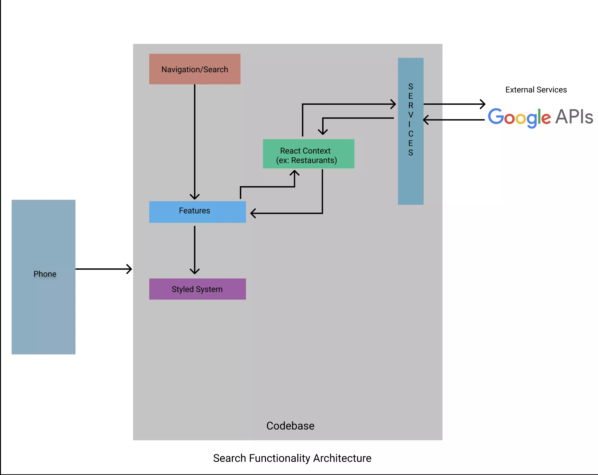
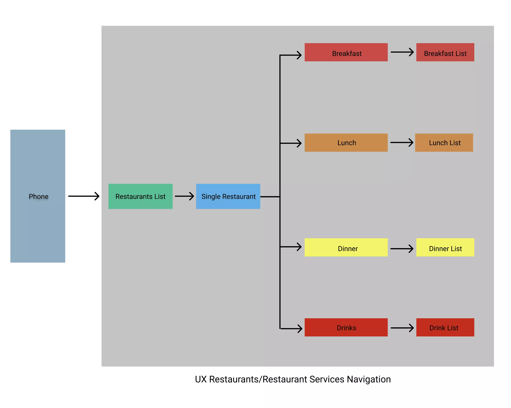

# GrubFinder

<hr />
<p align='center'>GrubFinder is a mobile app where users can find and order from eateries based on chosen locations and reviews availiable.</p>

</p>
<p align='center'><a href="https://loom.com/share/6c7cbe92235445b5a546c9eee0786873">  </br> <p align='center'> Watch Video</p> </a> </p>
<p align='center'><a href="https://www.loom.com/share/c8a43480c4dc420a9335a9cfe62a4ea9">  </br> <p align='center'> Watch Map Video</p> </a> </p>

## Mobile Deployment:

\_GrubFinder is currently availiable for testing on Iphone iOS and Android devices.

## Technology Stack & Tools

**Frontend**

_React Native_ was used to manage the applications state.

**Backend**

\__Firebase_ will be used as the DBMS.

**Other Technologies**

\__Google Auth 2.0_ will be user for user's login experience.

\__Google Maps Platform_(https://developers.google.com/maps/documentation) API's and SDK will be embeded to retrieve Maps, Routes, and Places from Google Maps.

\__Stripe_(https://stripe.com/) Payment infrastructure will be availiable enable users to stay within the application when making a safe and secure payment for during their shopping experience.

[_--global expo-cli_](https://docs.expo.dev/) boilermaker was used as the base of the project and built off of it.

```
  yarn install
```

```
  yarn run start
```

## Contributors/Collaborators:

- [Chris Bolosan](https://github.com/chrisbolosan) 📖

## Contact:

For more information, you can reach me at <cbolosan@gmail.com>.

Connect with me on <a href="www.linkedin.com/in/chrisbolosan">Linkedin</a>

## Figma Architectures:

Searchflow
<a href="https://www.figma.com/proto/eNp8CLmOwlXdJfB7iCSReM/Search-Functionality-Architecture?node-id=13%3A3&scaling=contain&page-id=0%3A1">

UX Restaurants/Restaurant Services
<a href="https://figma.com/proto/SSYi9VtzOXjr1DjqU62FaH/User-Restaurant-Navigation?node-id=13%3A3&scaling=contain&page-id=0%3A1">

## Additional Resources:

https://developers.google.com/maps/documentation

https://github.com/react-native-maps/react-native-maps

https://stripe.com/

https://reactnative.dev/docs/environment-setup

https://firebase.google.com/docs/database

https://oauth.net/2/

https://callstack.github.io/react-native-paper/

https://developer.apple.com/xcode/

https://developer.android.com/studio
